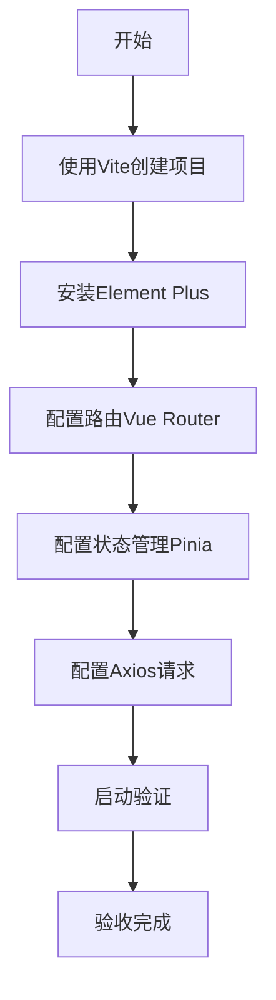

# 任务：前端项目初始化

## 任务概述

### 任务描述
使用Vite创建Vue 3 + TypeScript项目，配置Element Plus、路由、状态管理等基础依赖。

### 任务目的
建立前端项目的基础结构，为后续页面开发提供统一的框架支撑。

---

## 依赖关系

### 前置条件
- **前置任务**：无
- **需要的资源**：Node.js 18+、npm/pnpm
- **环境要求**：node -v显示正常版本

### 对后续的影响
- **后续任务**：plan_37（前端应用）
- **提供的产出**：可运行的前端项目框架

---

## 可视化辅助

### 步骤流程图


### 风险监控表
| 风险项 | 等级 | 触发信号 | 应对策略 | 责任人 |
|--------|------|----------|----------|--------|
| npm安装失败 | 中 | 网络超时 | 使用国内镜像 | 开发者 |
| Node版本过低 | 高 | 警告提示 | 升级到18+ | 开发者 |
| 端口冲突 | 低 | 启动失败 | 修改vite.config端口 | 开发者 |

---

## 执行步骤

### 步骤1：创建Vite项目
- **操作**：执行npm create vite@latest
- **输入**：项目名称、框架选择Vue
- **输出**：基础Vue3项目结构
- **注意事项**：选择TypeScript + Vue版本

### 步骤2：安装UI框架
- **操作**：安装Element Plus及相关图标库
- **输入**：npm install element-plus @element-plus/icons-vue
- **输出**：可用的UI组件库
- **注意事项**：按需引入配置减小包体积

### 步骤3：配置路由
- **操作**：安装并配置Vue Router
- **输入**：路由规划
- **输出**：router/index.ts配置文件
- **注意事项**：采用路由懒加载

### 步骤4：配置状态管理
- **操作**：安装并配置Pinia
- **输入**：状态规划
- **输出**：stores目录结构
- **注意事项**：区分持久化和非持久化状态

### 步骤5：配置HTTP请求
- **操作**：配置Axios实例、拦截器
- **输入**：API地址、超时设置
- **输出**：utils/request.ts
- **注意事项**：统一错误处理和Token注入

---

## 核心接口定义

### 主要类/接口
```typescript
// Axios请求配置
interface AxiosConfig {
  baseURL: string;
  timeout: number;
  headers?: Record<string, string>;
}

// 响应结果类型
interface ApiResponse<T = any> {
  code: number;
  message: string;
  data: T;
  timestamp: number;
}
```

### 数据结构
- UserState：用户信息状态
- AppState：应用全局状态

---

## 文件操作清单

### 需要创建的文件
- `package.json` - 前端项目配置
- `vite.config.ts` - Vite构建配置
- `tsconfig.json` - TypeScript配置
- `src/router/index.ts` - 路由配置
- `src/stores/index.ts` - 状态管理入口
- `src/utils/request.ts` - HTTP请求封装
- `src/api/index.ts` - API接口定义
- `src/styles/index.scss` - 全局样式

### 需要读取的文件
- `.claude/CLAUDE.md` - 技术栈规范

---

## 验收标准

### 功能验收
1. [ ] npm run dev成功启动
2. [ ] 页面正常显示Welcome信息
3. [ ] Element Plus组件可正常使用
4. [ ] 路由跳转正常工作
5. [ ] Axios请求可正常发送

### 质量验收
- [ ] TypeScript类型检查通过
- [ ] ESLint检查无错误

---

## 注意事项

### 技术注意点
- Vite devServer端口默认5173，与后端8080不同
- 配置代理解决跨域问题

### 安全注意点
- 环境变量不要包含敏感信息

### 性能注意点
- 启用Vite的build压缩
- 配置图片资源压缩
