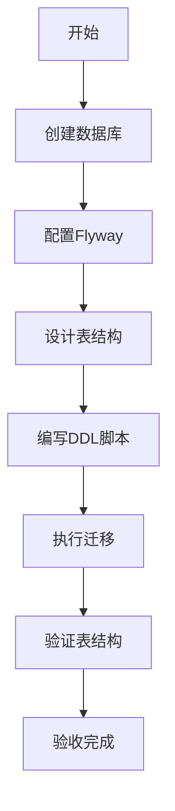
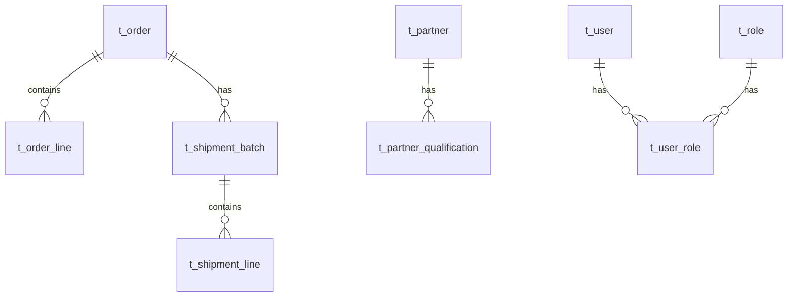

# 任务：数据库建表

## 任务概述

### 任务描述
创建MySQL数据库，设计并创建核心业务表结构，配置Flyway版本管理。

### 任务目的
建立项目的数据存储基础，确保所有业务模块有统一的数据表结构。

---

## 依赖关系

### 前置条件
- **前置任务**：plan_53（后端项目初始化）
- **需要的资源**：MySQL 8.0+、数据库设计文档
- **环境要求**：MySQL服务可连接

### 对后续的影响
- **后续任务**：plan_07（订单聚合）、plan_12（发运聚合）等所有业务模块
- **提供的产出**：数据库表结构、Flyway迁移脚本

---

## 可视化辅助

### 步骤流程图


### 核心表关系图


### 风险监控表
| 风险项 | 等级 | 触发信号 | 应对策略 | 责任人 |
|--------|------|----------|----------|--------|
| 表字段类型错误 | 高 | 数据溢出 | 使用DECIMAL存储金额 | 开发者 |
| 索引缺失 | 高 | 查询慢 | 添加查询字段索引 | 开发者 |
| 字符集问题 | 中 | 乱码 | 统一使用utf8mb4 | 开发者 |

---

## 执行步骤

### 步骤1：创建数据库
- **操作**：在MySQL中创建数据库和用户
- **输入**：数据库名、用户名、密码
- **输出**：空的数据库
- **注意事项**：字符集设置为utf8mb4

### 步骤2：配置Flyway
- **操作**：在后端项目中添加Flyway依赖和配置
- **输入**：数据库连接信息
- **输出**：Flyway迁移目录
- **注意事项**：迁移脚本按V1__、V2__命名

### 步骤3：设计核心表结构
- **操作**：根据设计文档创建表DDL
- **输入**：业务需求
- **输出**：表结构设计
- **注意事项**：遵循t_前缀、snake_case命名

### 步骤4：创建基础表
- **操作**：创建用户表、权限表、字典表等基础表
- **输入**：表结构设计
- **输出**：DDL脚本
- **注意事项**：添加必要的索引

### 步骤5：创建业务表
- **操作**：创建订单、发运、合作方等业务表
- **输入**：各聚合模块的实体设计
- **输出**：DDL脚本
- **注意事项**：外键关系和约束

### 步骤6：执行迁移验证
- **操作**：启动项目执行Flyway迁移
- **输入**：无
- **输出**：创建完成的表结构
- **注意事项**：检查flyway_schema_history表

---

## 核心接口定义

### 主要类/接口
```java
// Flyway配置类
@Configuration
public class FlywayConfig {
    // 配置Flyway Bean
}

// 数据库连接配置
spring:
  datasource:
    url: jdbc:mysql://localhost:3306/order_platform?useUnicode=true&characterEncoding=utf8mb4
    username: ${DB_USERNAME}
    password: ${DB_PASSWORD}
  flyway:
    enabled: true
    locations: classpath:db/migration
```

### 数据结构
- t_user：用户表
- t_role：角色表
- t_user_role：用户角色关联表
- t_order：订单表
- t_order_line：订单行表
- t_shipment_batch：发运批次表
- t_partner：合作方表

---

## 文件操作清单

### 需要创建的文件
- `order-platform-api/src/main/resources/db/migration/V1__create_base_table.sql` - 基础表
- `order-platform-api/src/main/resources/db/migration/V2__create_order_table.sql` - 订单表
- `order-platform-api/src/main/resources/db/migration/V3__create_shipment_table.sql` - 发运表
- `order-platform-api/src/main/resources/db/migration/V4__create_partner_table.sql` - 合作方表
- `order-platform-api/src/main/resources/application.yml` - 数据源配置

### 需要读取的文件
- `.claude/CLAUDE.md` - 数据库命名规范
- `.claude/design-document.md` - 数据库设计文档

---

## 验收标准

### 功能验收
1. [ ] 数据库创建成功，字符集为utf8mb4
2. [ ] Flyway迁移成功执行
3. [ ] 所有表创建成功，结构符合设计
4. [ ] 索引创建成功
5. [ ] flyway_schema_history表记录正确

### 质量验收
- [ ] 表名符合t_前缀规范
- [ ] 字段名符合snake_case规范
- [ ] 金额字段使用DECIMAL类型

---

## 注意事项

### 技术注意点
- 金额字段必须使用DECIMAL，禁止使用FLOAT/DOUBLE
- 时间字段统一使用datetime类型
- 软删除字段命名为deleted，默认值为0

### 安全注意点
- 密码字段存储BCrypt加密后的值
- 敏感配置使用环境变量

### 性能注意点
- 为查询频繁的字段添加索引
- 大表考虑分表策略
