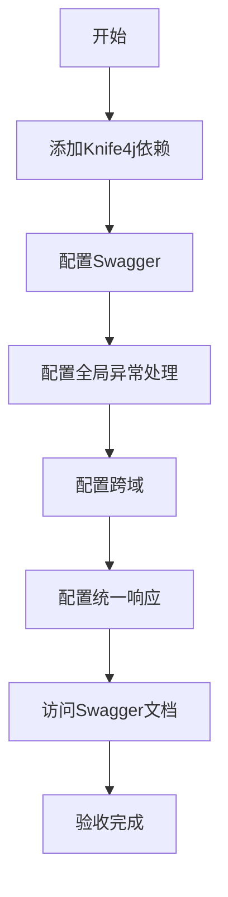

# 任务：API启动模块配置

## 任务概述

### 任务描述
配置Spring Boot API启动模块，包括Swagger文档、全局异常处理、跨域配置等。

### 任务目的
提供统一的API入口和文档，为前后端联调提供标准接口规范。

---

## 依赖关系

### 前置条件
- **前置任务**：plan_53（后端项目初始化）、plan_55（数据库建表）
- **需要的资源**：Knife4j依赖
- **环境要求**：Spring Boot项目可正常启动

### 对后续的影响
- **后续任务**：所有业务模块的API开发
- **提供的产出**：可用的Swagger文档、API规范

---

## 可视化辅助

### 步骤流程图


### API架构图
```
┌─────────────────────────────────────────────┐
│           Nginx 反向代理                    │
├─────────────────────────────────────────────┤
│           Spring Boot 应用                  │
│  ┌──────────────────────────────────────┐  │
│  │          Controller 层               │  │
│  ├──────────────────────────────────────┤  │
│  │   ┌──────────────────────────────┐   │  │
│  │   │    全局异常处理器             │   │  │
│  │   └──────────────────────────────┘   │  │
│  ├──────────────────────────────────────┤  │
│  │   ┌──────────────────────────────┐   │  │
│  │   │    统一响应包装               │   │  │
│  │   └──────────────────────────────┘   │  │
│  └──────────────────────────────────────┘  │
├─────────────────────────────────────────────┤
│          Swagger/Knife4j 文档               │
└─────────────────────────────────────────────┘
```

### 风险监控表
| 风险项 | 等级 | 触发信号 | 应对策略 | 责任人 |
|--------|------|----------|----------|--------|
| Swagger文档无法访问 | 中 | 404错误 | 检查依赖和配置 | 开发者 |
| 跨域配置失效 | 中 | 浏览器报错 | 检查CorsConfiguration | 开发者 |
| 异常未捕获 | 高 | 返回500错误 | 检查全局异常处理器 | 开发者 |

---

## 执行步骤

### 步骤1：添加Knife4j依赖
- **操作**：在pom.xml中添加knife4j依赖
- **输入**：依赖版本号
- **输出**：可用的Swagger文档框架
- **注意事项**：版本要与Spring Boot 3.x兼容

### 步骤2：配置Swagger
- **操作**：创建Swagger配置类，设置API信息
- **输入**：项目标题、描述、版本
- **输出**：SwaggerConfig配置类
- **注意事项**：生产环境关闭Swagger

### 步骤3：配置全局异常处理
- **操作**：创建@RestControllerAdvice
- **输入**：异常类型定义
- **输出**：GlobalExceptionHandler类
- **注意事项**：区分业务异常和系统异常

### 步骤4：配置跨域
- **操作**：添加WebMvcConfigurer配置CORS
- **输入**：允许的域名、方法
- **输出**：CorsConfig配置类
- **注意事项**：生产环境限制允许的域名

### 步骤5：配置统一响应
- **操作**：创建Result响应类和ResponseAdvice
- **输入**：响应结构定义
- **输出**：统一响应包装
- **注意事项**：Swagger文档类型需要排除

---

## 核心接口定义

### 主要类/接口
```java
// 统一响应结果
public class Result<T> {
    private Integer code;
    private String message;
    private T data;
    private Long timestamp;
    // 静态工厂方法：ok()、fail()、error()
}

// 全局异常处理器
@RestControllerAdvice
public class GlobalExceptionHandler {
    @ExceptionHandler(BusinessException.class)
    public Result<?> handleBusinessException(BusinessException e);

    @ExceptionHandler(Exception.class)
    public Result<?> handleException(Exception e);
}

// Swagger配置
@Configuration
public class SwaggerConfig {
    @Bean
    public OpenAPI customOpenAPI();
}
```

### 数据结构
- BusinessException：业务异常类
- ErrorCode：错误码枚举

---

## 文件操作清单

### 需要创建的文件
- `order-platform-common/src/main/java/{package}/response/Result.java` - 统一响应
- `order-platform-common/src/main/java/{package}/exception/BusinessException.java` - 业务异常
- `order-platform-common/src/main/java/{package}/exception/GlobalExceptionHandler.java` - 异常处理
- `order-platform-api/src/main/java/{package}/config/SwaggerConfig.java` - Swagger配置
- `order-platform-api/src/main/java/{package}/config/CorsConfig.java` - 跨域配置
- `order-platform-api/src/main/java/{package}/config/ResponseAdvice.java` - 响应包装

### 需要读取的文件
- `pom.xml` - 添加knife4j依赖

---

## 验收标准

### 功能验收
1. [ ] 访问/doc.html可正常显示Swagger文档
2. [ ] API接口返回统一Result格式
3. [ ] 异常被全局处理器捕获
4. [ ] 前端可正常调用接口（无跨域问题）

### 质量验收
- [ ] 接口文档完整，包含参数说明
- [ ] 错误码定义清晰
- [ ] 响应时间戳格式统一

---

## 注意事项

### 技术注意点
- Spring Boot 3.x使用OpenAPI 3.0规范
- Swagger UI路径为/doc.html

### 安全注意点
- 生产环境必须关闭Swagger文档
- 敏感接口添加权限注解

### 性能注意点
- 响应包装使用AOP，避免影响性能
- 异常处理日志级别合理设置
