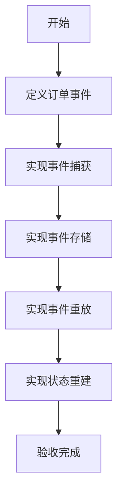

# 任务：订单事件溯源

## 任务概述

### 任务描述
实现订单的事件溯源机制，支持从事件流重建订单状态，实现数据的可追溯性和可恢复性。

### 任务目的
通过事件溯源模式，记录订单的所有变更历史，支持状态重放和审计追溯。

---

## 依赖关系

### 前置条件
- **前置任务**：plan_06（事件总线）、plan_09（订单状态机）
- **需要的资源**：事件存储
- **环境要求**：事件总线可用

### 对后续影响
- **提供的产出**：订单事件重放能力、审计追溯能力

---

## 可视化辅助

### 步骤流程图


### 事件存储图
```
┌─────────────────────────────────────────────────┐
│                  事件存储                        │
├─────────────────────────────────────────────────┤
│  事件ID   订单ID   事件类型      版本号  时间戳  │
│  E001     O001     ORDER_CREATED  1       T1    │
│  E002     O001     LINE_ADDED     2       T2    │
│  E003     O001     ORDER_SUBMITTED 3       T3    │
│  E004     O001     STATUS_CHANGED  4       T4    │
└─────────────────────────────────────────────────┘
                    ↓ 重放
┌─────────────────────────────────────────────────┐
│              重建的订单状态                       │
│        状态: EXECUTING, 版本: 4                 │
└─────────────────────────────────────────────────┘
```

### 风险监控表
| 风险项 | 等级 | 触发信号 | 应对策略 | 责任人 |
|--------|------|----------|----------|--------|
| 事件丢失 | 高 | 数据不一致 | 事件持久化 | 开发者 |
| 重放失败 | 中 | 状态错误 | 幂等性处理 | 开发者 |
| 版本冲突 | 中 | 并发问题 | 乐观锁机制 | 开发者 |

---

## 执行步骤

### 步骤1：定义订单事件类型
- **操作**：定义所有订单相关事件
- **输入**：业务操作
- **输出**：事件类
- **注意事项**：事件命名清晰

### 步骤2：实现事件捕获
- **操作**：在Service中捕获业务事件
- **输入**：业务操作
- **输出**：领域事件
- **注意事项**：不遗漏关键事件

### 步骤3：实现事件存储
- **操作**：将事件持久化到数据库
- **输入**：领域事件
- **输出**：事件记录
- **注意事项**：事件不可变

### 步骤4：实现事件重放
- **操作**：从事件流重建状态
- **输入**：订单ID
- **输出**：重建的订单
- **注意事项**：幂等性处理

### 步骤5：实现状态查询
- **操作**：查询任意时刻的状态
- **输入**：订单ID、时间点
- **输出**：历史状态
- **注意事项**：性能优化

### 步骤6：实现审计报告
- **操作**：生成变更审计报告
- **输入**：订单ID
- **输出**：审计数据
- **注意事项**：包含完整操作人信息

---

## 核心接口定义

### 主要类/接口
```java
// 订单事件接口
public interface OrderEventService {
    // 保存事件
    void save(OrderDomainEvent event);
    // 获取事件流
    List<OrderDomainEvent> getEvents(Long orderId);
    // 获取事件流（从指定版本）
    List<OrderDomainEvent> getEvents(Long orderId, Long fromVersion);
    // 重放事件
    Order replay(Long orderId);
    // 查询历史状态
    Order getStateAt(Long orderId, LocalDateTime time);
}

// 订单领域事件
public abstract class OrderDomainEvent extends DomainEvent {
    private final Long orderId;
    private final Long version;
}

// 具体事件类型
public class OrderCreatedEvent extends OrderDomainEvent {
    private final String orderNo;
    private final Long customerId;
    private final BigDecimal totalAmount;
}

public class OrderLineAddedEvent extends OrderDomainEvent {
    private final OrderLineDTO line;
}

public class OrderStatusChangedEvent extends OrderDomainEvent {
    private final OrderStatus oldStatus;
    private final OrderStatus newStatus;
    private final String reason;
}

public class OrderSubmittedEvent extends OrderDomainEvent {
    private final Long submitterId;
    private final LocalDateTime submitTime;
}

// 事件重放服务
public interface EventReplayService {
    // 重放到指定版本
    Order replayToVersion(Long orderId, Long version);
    // 重放到指定时间
    Order replayToTime(Long orderId, LocalDateTime time);
}
```

### 数据结构
- OrderDomainEvent：订单领域事件基类
- OrderCreatedEvent：订单创建事件
- OrderLineAddedEvent：订单行添加事件
- OrderStatusChangedEvent：状态变更事件

---

## 文件操作清单

### 需要创建的文件
- `order-platform-order/src/main/java/{package}/event/OrderDomainEvent.java`
- `order-platform-order/src/main/java/{package}/event/OrderCreatedEvent.java`
- `order-platform-order/src/main/java/{package}/event/OrderLineAddedEvent.java`
- `order-platform-order/src/main/java/{package}/event/OrderStatusChangedEvent.java`
- `order-platform-order/src/main/java/{package}/service/OrderEventService.java`
- `order-platform-order/src/main/java/{package}/service/EventReplayService.java`
- `order-platform-order/src/main/resources/db/migration/V10__create_order_event_table.sql`

### 需要读取的文件
- `plan_06_事件总线.md` - 事件总线基类
- `.claude/CLAUDE.md` - 事件溯源规范

---

## 验收标准

### 功能验收
1. [ ] 所有订单事件正确保存
2. [ ] 事件可按订单ID查询
3. [ ] 事件重放可正确重建状态
4. [ ] 支持查询历史状态
5. [ ] 审计报告数据完整

### 性能验收
- [ ] 事件保存 < 50ms
- [ ] 事件重放 < 500ms

---

## 注意事项

### 技术注意点
- 事件版本号必须递增
- 事件不可变，不支持修改

### 安全注意点
- 事件需要记录操作人
- 敏感信息需要脱敏

### 性能注意点
- 事件存储使用批量插入
- 事件查询使用缓存
- 定期归档历史事件
